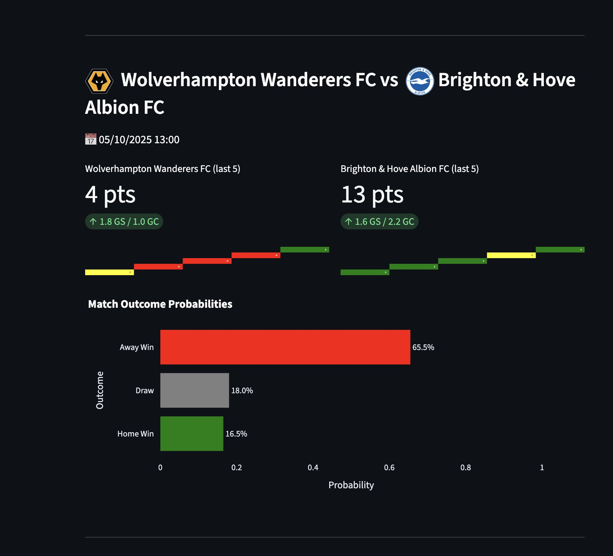

# ⚽ Premier League Predictor

A web app that predicts the outcomes of upcoming Premier League matches based on historical match data using a machine learning model. The app also displays last 5 games form, team stats, and team crests with a clean, interactive interface.

---

## Features

- Predict probabilities for **Home Win**, **Draw**, and **Away Win** for upcoming Premier League matches.
- Display **last 5 games form** for both teams with a color-coded heatmap.
- Show **goals scored/conceded** and **points from last 5 games**.
- Display **team crests** alongside team names.
- Interactive **Plotly charts** for match outcome probabilities.
- Dynamically fetches **next 10 Premier League fixtures** using [Football-Data.org API](https://www.football-data.org/).

---

## Demo



*Example output showing team crests, last 5 games form, and predicted probabilities.*

---

## Table of Contents

- [Installation](#installation)  
- [Usage](#usage)  
- [Project Structure](#project-structure)  
- [Data](#data)  
- [Model](#model)  
- [API Key](#api-key)  
- [Customization](#customization)  
- [License](#license)  

---

## Installation

1. Clone the repository:

```
git clone https://github.com/yourusername/premier-league-predictor.git
cd premier-league-predictor
```

2. Create a virtual environment and activate it:

```
python -m venv venv
source venv/bin/activate   # Linux/macOS
venv\Scripts\activate      # Windows
```

3. Install dependencies:

```
pip install -r requirements.txt
```

---

## Usage

1. Add your **Football-Data.org API key** in `config.py`:

```
API_KEY = "YOUR_API_KEY"
```

2. Ensure you have the historical CSV data files in the project data folder:

```
PL_2021_2022.csv
PL_2022_2023.csv
PL_2023_2024.csv
PL_2024_2025.csv
```

3. Run the Streamlit app:

```
streamlit run app.py
```

4. Click **🔮 Predict Next 10 Fixture Odds** to see predictions, team stats, last 5 games form, and match probability charts.

---

## Project Structure

```
.
├── app.py                  # Main Streamlit app
├── config.py               # API key configuration
├── premier_league_model.pkl # Pretrained ML model
├── PL_2021_2022.csv         # Historical data
├── PL_2022_2023.csv
├── PL_2023_2024.csv
├── PL_2024_2025.csv
├── requirements.txt        # Python dependencies
└── README.md               # This file
```

---

## Data

The app uses **historical Premier League match data** in CSV format. Each CSV should include at least the following columns:

- `Date` – Match date
- `HomeTeam` – Home team name
- `AwayTeam` – Away team name
- `FTHG` – Full time home goals
- `FTAG` – Full time away goals
- `FTR` – Full time result (`H` for home win, `D` for draw, `A` for away win)

---

## Model

- Trained using historical match statistics (goals scored/conceded, last 5 games points).
- Saves as **`premier_league_model.pkl`** with:

```
clf, le_team = pickle.load(open("premier_league_model.pkl", "rb"))
```

- Predicts **Home Win / Draw / Away Win probabilities** for new matches.

---

## API Key

This project uses [Football-Data.org API](https://www.football-data.org/):

1. Sign up and get a free API key.
2. Store the key in `config.py`:

```
API_KEY = "YOUR_API_KEY"
```

3. The app fetches **next 10 Premier League fixtures** automatically.

---

## Customization

- **Number of fixtures:** Change `get_next_matches(n=10)` to a different `n`.
- **Historical data:** Add more CSVs to `files = ["PL_2021_2022.csv", ...]` for better predictions.
- **Last 5 games heatmap colors:** Modify colors in `team_last_5_stats()` or in Plotly chart section.

---

## Dependencies

- Python 3.10+  
- Streamlit  
- Pandas  
- Requests  
- Pickle  
- RapidFuzz – for fuzzy team matching  
- Plotly – for interactive charts  

Install all via:

```
pip install streamlit pandas requests rapidfuzz plotly
```

---

## License

MIT License – see `LICENSE` file.

---

## Notes

- Team names returned by the API may differ from your historical data CSV; fuzzy matching ensures predictions work correctly.
- The last 5 games heatmap ensures **5 equal segments**, even if the team has played fewer than 5 previous games.
- Team crests are resized consistently to prevent overlap.
